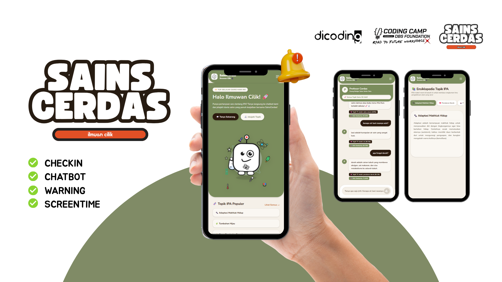

# 🌟 Sains Cerdas (Chatbot IPA SD)

Sains Cerdas adalah aplikasi Chatbot interaktif yang dirancang khusus untuk membantu siswa Sekolah Dasar (SD) dalam belajar Ilmu Pengetahuan Alam (IPA). Aplikasi ini mengintegrasikan kecerdasan buatan (AI) modern untuk memberikan jawaban yang akurat, relevan, serta aman bagi anak-anak.

Proyek ini dibangun sebagai bagian dari Capstone Project DBS 2026.
## 📷 Tampilan Aplikasi

<p align="center">
  
</p>

<p align="center">
  
</p>
## 🚀 Fitur Utama

- **🤖 AI Chatbot Cerdas:** Menggunakan model NLP (TensorFlow/Keras) untuk klasifikasi topik dan *Retrieval-Augmented Generation* (RAG) menggunakan TiDB Vector untuk pencarian jawaban berbasis *knowledge base*.
- **⏳ Screen Time Manager:** Memberikan pengingat otomatis jika anak telah belajar terlalu lama (20-30 menit) dan menyarankan aktivitas fisik agar mata tetap sehat.
- **✨ UI/UX Ramah Anak:** Antarmuka responsif dan menarik menggunakan React, Vite, TailwindCSS, dan animasi interaktif dari Framer Motion.
- **🔐 Keamanan & Autentikasi:** Dukungan autentikasi JWT pada sisi Backend Node.js.

---

## 🏗️ Arsitektur Proyek

Proyek ini menggunakan arsitektur *3-Tier* yang memisahkan Frontend, Backend API, dan AI Engine.

1. **Frontend (React + Vite)**
   - Direktori: `/frontend`
   - Teknologi: React 19, Vite, Tailwind CSS, Framer Motion, Axios.
   - Fungsi: Menampilkan antarmuka pengguna (UI) chatbot.

2. **Backend Services (Node.js + Express)**
   - Direktori: `/backend`
   - Teknologi: Node.js, Express, Supabase, MySQL2, JWT, Bcrypt.
   - Fungsi: Mengatur autentikasi pengguna, manajemen database relasional, dan menjembatani komunikasi ke sistem AI.

3. **AI Engine (Python + FastAPI)**
   - Direktori: `/python`
   - Teknologi: Python, FastAPI, TensorFlow/Keras, SentenceTransformers (bge-m3), TiDB Vector.
   - Fungsi: Menyediakan endpoint untuk pemrosesan NLP, RAG, moderasi, dan pelacakan sesi layar.

---

## 🛠️ Prasyarat

Pastikan Anda telah menginstal beberapa alat berikut di sistem Anda sebelum menjalankan aplikasi:
- [Node.js](https://nodejs.org/) (Versi terbaru atau LTS yang direkomendasikan)
- [Python 3.9+](https://www.python.org/)
- Database MySQL/TiDB

---

## 🏃 Cara Menjalankan Secara Lokal

### 1. Menjalankan AI Engine (Python)

1. Masuk ke direktori `python`:
   ```bash
   cd python
   ```
2. Buat Virtual Environment (opsional namun disarankan):
   ```bash
   python -m venv env
   source env/bin/activate  # Untuk Linux/Mac
   env\Scripts\activate     # Untuk Windows
   ```
3. Instal dependencies:
   ```bash
   pip install -r requirements.txt
   ```
4. Buat file `config.env` dan atur konfigurasi database TiDB Anda:
   ```env
   DB_HOST=your_tidb_host
   DB_PORT=4000
   DB_USER=your_username
   DB_PASSWORD=your_password
   DB_NAME=your_database_name
   ```
5. Jalankan server FastAPI:
   ```bash
   uvicorn app:app --host 0.0.0.0 --port 8000 --reload
   ```

### 2. Menjalankan Backend Node.js

1. Buka terminal baru dan masuk ke direktori `backend`:
   ```bash
   cd backend
   ```
2. Instal dependencies:
   ```bash
   npm install
   ```
3. Konfigurasi file `.env` untuk menghubungkan backend dengan DB dan API Python.
4. Jalankan server pengembangan:
   ```bash
   npm run dev
   ```

### 3. Menjalankan Frontend React

1. Buka terminal baru dan masuk ke direktori `frontend`:
   ```bash
   cd frontend
   ```
2. Instal dependencies:
   ```bash
   npm install
   ```
3. Jalankan aplikasi Vite:
   ```bash
   npm run dev
   ```

Aplikasi web sekarang akan berjalan dan dapat diakses di browser Anda!

---
