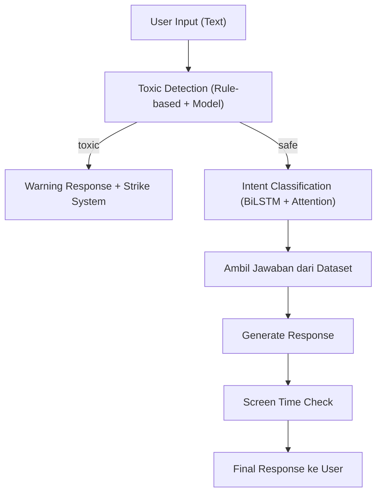

# Chatbot Edukasi IPA SD — AI Engineer Capstone

Sistem chatbot edukasi berbasis AI untuk siswa SD kelas 4-5, dengan fitur pembelajaran IPA interaktif, manajemen screen time, dan moderasi bahasa.

## Ringkasan Analisis

### Aset Yang Sudah Ada
| Aset | Lokasi | Keterangan |
|------|--------|------------|
| Dataset IPA SD | `dataset/Dataset - dataclean_revisi.csv` | 3.348 baris, 15 topik, format CSV |
| Knowledge Base | Referensi dari `nlp-chatbot/data_knowledge.csv` | 1.034 Q&A pairs, separator `\|` |
| Reference chatbot | `nlp-chatbot/cetbot.py` | RAG chatbot (Ollama + tidb) — sebagai referensi saja |

### 15 Topik/Kategori IPA
`adaptasi makhluk hidup`, `air`, `alat pencernaan dan makanan`, `alat pernapasan manusia dan hewan`, `alat tubuh manusia dan hewan`, `benda dan sifatnya`, `bumi dan peristiwa alam`, `cahaya dan sifat-sifatnya`, `gaya, gerak, dan energi`, `organ tubuh manusia dan hewan`, `peredaran darah`, `peristiwa alam`, `sistem pernapasan`, `sumber daya alam dan kegunaannya`, `tumbuhan hijau`

---

## Arsitektur Sistem



---

## Proposed Changes

### Component 1: Dataset Preparation

#### [NEW] [dataset_ipa.csv](file:///c:/Users/Erycaa/Downloads/chatbot-capstone/DBS-Capstone-2026/dataset/dataset_ipa.csv)
- Transform `Dataset - dataclean_revisi.csv` ke format yang dibutuhkan model: `question | answer | category`
- Kolom `category` diambil dari kolom `topik` yang sudah ada (15 kategori)
- Clean dan normalize text

#### [NEW] [dataset_toxic.csv](file:///c:/Users/Erycaa/Downloads/chatbot-capstone/DBS-Capstone-2026/dataset/dataset_toxic.csv)
- Dataset moderasi bahasa dengan kolom `text | label` (safe/toxic)
- ~200+ entries berisi contoh kata sopan dan kasar dalam bahasa Indonesia
- Mencakup variasi slang/typo: `gblk`, `anj`, `b*doh`, `bgo`, dll.

---

### Component 2: Data Preprocessing

#### [NEW] [preprocessing.py](file:///c:/Users/Erycaa/Downloads/chatbot-capstone/DBS-Capstone-2026/preprocessing.py)
- Load dataset CSV
- Text cleaning: lowercase, remove punctuation, strip whitespace
- Tokenization menggunakan `tf.keras.preprocessing.text.Tokenizer`
- Padding sequences
- Label encoding dengan `LabelEncoder` dari scikit-learn
- Train/validation split (80/20)
- Export tokenizer dan label encoder (pickle)

---

### Component 3: Model Architecture (Deep Learning)

#### [NEW] [model.py](file:///c:/Users/Erycaa/Downloads/chatbot-capstone/DBS-Capstone-2026/model.py)

**Arsitektur:**
```
Input Text → Embedding Layer → BiLSTM → Attention Layer → Dense → Output (Softmax)
```

**Detail komponen:**

1. **Embedding Layer** — `tf.keras.layers.Embedding` (vocab_size, embed_dim=128)
2. **BiLSTM Layer** — `tf.keras.layers.Bidirectional(LSTM(128, return_sequences=True))`
3. **Custom Attention Layer** — `tf.keras.layers.Layer` subclass:
   - Learnable weight matrix
   - Softmax attention scores
   - Weighted sum of BiLSTM outputs
4. **Dense Layers** — Dense(64, relu) → Dropout(0.5) → Dense(num_classes, softmax)
5. **Functional API** — `tf.keras.Model(inputs, outputs)`

#### Custom Components:

**(A) AttentionLayer (Custom Layer)**
```python
class AttentionLayer(tf.keras.layers.Layer):
    def build(self, input_shape):
        self.W = self.add_weight(...)
        self.b = self.add_weight(...)
        self.u = self.add_weight(...)
    def call(self, x):
        # Compute attention scores
        # Apply softmax
        # Return weighted sum
```

**(B) WeightedCategoricalCrossentropy (Custom Loss)**
- Mengatasi class imbalance pada 15 kategori
- Bobot dihitung dari inverse frequency tiap kategori

**(C) Custom Callbacks**
- `EarlyStopping` (patience=5, monitor='val_loss')
- `TrainingLogger` — custom callback yang log metrics setiap epoch

---

### Component 4: Model Training

#### [NEW] [train.py](file:///c:/Users/Erycaa/Downloads/chatbot-capstone/DBS-Capstone-2026/train.py)

**Training loop menggunakan `tf.GradientTape`:**
```python
for epoch in range(epochs):
    for batch in train_dataset:
        with tf.GradientTape() as tape:
            predictions = model(x_batch, training=True)  # Forward pass
            loss = loss_fn(y_batch, predictions)          # Loss calculation
        gradients = tape.gradient(loss, model.trainable_variables)  # Gradient
        optimizer.apply_gradients(zip(gradients, model.trainable_variables))  # Update
    # Validation & Metrics logging
```

**Fitur:**
- Forward pass + loss calculation
- Gradient calculation + weight update
- Validation per epoch
- Metrics logging (accuracy, precision, recall, F1)
- TensorBoard logging
- Model checkpoint (best val_accuracy)
- Export final model: `model.save("chatbot_model.keras")`

---

### Component 5: TensorBoard Integration

#### TensorBoard Logs → `logs/` directory
- `tf.summary.FileWriter` untuk training dan validation
- Visualisasi: loss, accuracy, val_loss, val_accuracy
- Monitoring per epoch

---

### Component 6: Model Evaluation

#### [NEW] [evaluate.py](file:///c:/Users/Erycaa/Downloads/chatbot-capstone/DBS-Capstone-2026/evaluate.py)
- Load model `.keras`
- Compute: **Accuracy, Precision, Recall, F1-Score**
- Classification report per kategori
- Confusion matrix
- Target: **Accuracy ≥ 85%**

---

### Component 7: Toxic Moderation System

#### [NEW] [moderation.py](file:///c:/Users/Erycaa/Downloads/chatbot-capstone/DBS-Capstone-2026/moderation.py)

**Rule-Based Toxic Filter:**
- Blacklist kata kasar (bahasa Indonesia)
- Regex filtering untuk variasi: `b*doh`, `gblk`, `anj`, `tl*l`, etc.
- Normalisasi slang/typo sebelum pengecekan

**Strike System:**
| Strike | Aksi |
|--------|------|
| 1x | Warning ringan: "Yuk gunakan bahasa yang lebih sopan 😊" |
| 2x | Reminder sopan: "Kamu sudah mendapat 2 peringatan, yuk jaga kata-kata ya 😊" |
| 3x | Temporary cooldown: "Istirahat dulu ya selama 5 menit 🕐" |

**Kategori output:** `safe`, `warning`, `toxic`

---

### Component 8: Screen Time Management

#### [NEW] [screen_time.py](file:///c:/Users/Erycaa/Downloads/chatbot-capstone/DBS-Capstone-2026/screen_time.py)

**Rule-based system:**
```python
if usage_time >= 30:
    reminder = "Kamu sudah belajar 30 menit, yuk istirahat sebentar 😊"
elif usage_time >= 20:
    reminder = "Sudah 20 menit belajar, sebentar lagi waktunya istirahat ya 📚"
```

**Fitur:**
- Track session start time
- Hitung durasi penggunaan
- Reminder di 20 dan 30 menit
- Rekomendasi aktivitas non-gadget: olahraga, membaca buku, bermain outdoor

---

### Component 9: Inference Pipeline

#### [NEW] [inference.py](file:///c:/Users/Erycaa/Downloads/chatbot-capstone/DBS-Capstone-2026/inference.py)
- Load model `.keras`
- Load tokenizer + label encoder (pickle)
- Preprocessing text input
- Predict kategori
- Lookup jawaban dari dataset
- Return formatted response

---

### Component 10: REST API (FastAPI)

#### [NEW] [app.py](file:///c:/Users/Erycaa/Downloads/chatbot-capstone/DBS-Capstone-2026/app.py)

**Endpoints:**

| Method | Endpoint | Fungsi |
|--------|----------|--------|
| `POST` | `/chat` | Endpoint utama — menerima pertanyaan, return jawaban + moderation + screen time |
| `POST` | `/predict` | Prediksi kategori pertanyaan saja |
| `POST` | `/moderation` | Cek toxic/safe saja |
| `GET` | `/health` | Health check status API |

**Request/Response example (`/chat`):**
```json
// Request
{ "message": "Apa itu fotosintesis?", "session_id": "abc123" }

// Response
{
  "category": "tumbuhan hijau",
  "answer": "Fotosintesis adalah proses tumbuhan membuat makanan...",
  "moderation": { "status": "safe", "strikes": 0 },
  "screen_time": { "duration_minutes": 15, "reminder": null }
}
```

---

### Component 11: Documentation & README

#### [MODIFY] [README.md](file:///c:/Users/Erycaa/Downloads/chatbot-capstone/DBS-Capstone-2026/README.md)
- Deskripsi project
- Business problem & solusi
- Arsitektur model
- Teknologi stack
- Cara instalasi & menjalankan
- Struktur folder
- API documentation
- Evaluasi performa

#### [NEW] [requirements.txt](file:///c:/Users/Erycaa/Downloads/chatbot-capstone/DBS-Capstone-2026/requirements.txt)
```
tensorflow>=2.15.0
fastapi>=0.109.0
uvicorn>=0.27.0
pandas>=2.1.0
numpy>=1.26.0
scikit-learn>=1.4.0
tensorboard>=2.15.0
```

---

## Struktur Folder Final

```
DBS-Capstone-2026/
├── dataset/
│   ├── Dataset - dataclean_revisi.csv   # Dataset asli
│   ├── dataset_ipa.csv                  # Dataset IPA (processed)
│   └── dataset_toxic.csv               # Dataset toxic moderation
├── logs/                                # TensorBoard logs
│   ├── train/
│   └── validation/
├── models/                              # Saved models
│   └── chatbot_model.keras
├── artifacts/                           # Tokenizer, label encoder
│   ├── tokenizer.pickle
│   └── label_encoder.pickle
├── preprocessing.py                     # Data preprocessing
├── model.py                             # Model architecture
├── train.py                             # Training script (GradientTape)
├── evaluate.py                          # Evaluation metrics
├── inference.py                         # Inference pipeline
├── moderation.py                        # Toxic filter + strike system
├── screen_time.py                       # Screen time management
├── app.py                               # FastAPI REST API
├── requirements.txt                     # Dependencies
└── README.md                            # Project documentation
```

---

## Verification Plan

### Automated Tests
1. **Training verification**: Run `train.py`, verify model trains without errors and achieves ≥85% accuracy
2. **TensorBoard**: Run `tensorboard --logdir logs/` to verify logging works
3. **API testing**: Start FastAPI server, test all 4 endpoints with `curl` or browser
4. **Model export**: Verify `chatbot_model.keras` is saved correctly and can be loaded

### Manual Verification
1. Test chatbot with sample questions: "Apa itu fotosintesis?", "Mengapa pelangi muncul?"
2. Test toxic detection with: "kamu bodoh", "halo teman"
3. Test screen time reminder after 30 minutes
4. Verify TensorBoard dashboard shows loss/accuracy curves

---

## Open Questions

> [!IMPORTANT]
> **Dataset Size**: Dataset asli memiliki 3.348 rows dengan 15 kategori. Apakah Anda ingin menggunakan semua data atau subset tertentu?

> [!IMPORTANT]
> **Python Environment**: Apakah sudah ada virtual environment yang siap, atau perlu saya buatkan sekalian? Apakah Python sudah terinstall dan TensorFlow compatible (Python 3.9-3.11)?

> [!NOTE]
> **Knowledge Base Integration**: Dataset referensi dari `nlp-chatbot/data_knowledge.csv` (1.034 Q&A) juga bisa digabungkan sebagai tambahan knowledge base. Apakah ingin disertakan?

> [!NOTE]
> **Model Training Time**: Training BiLSTM + Attention pada 3.348 samples relatif cepat (~5-15 menit tergantung hardware). Apakah ada GPU yang tersedia atau cukup CPU?
